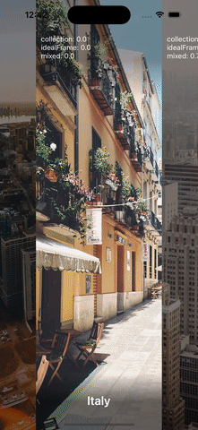

# PluginableFlowLayout

Reusable layout with alignment. Could be extended with plugins.


## How to use PluginableFlowLayout

1. When creating collection layout use `PluginableFlowLayout`
2. Setup base `UICollectionViewFlowLayout` with your needs
    - properly setup `scrollDirection`
    - other settings
3. If needed custom alignment, modify `UICollectionView` - turn off `isPagingEnabled` (default value is `false`) and set `decelerationRate` to `.fast`.

## PluginableFlowLayout

Layout descendant of `UICollectionViewFlowLayout`. 

Has feature for alignment:
- `lineStart` - left alignment
- `lineCenter` - center alignment
- `lineEnd` - right alignment

If pass `nil` - there will not be any modifications for `targetContentOffset` (you can use default `isPagingEnabled = true` property for items with equal sizes).

Supports items with different sizes.

## FlowLayoutPlugin

Protocol for custom plugins

## PercentageFlowLayoutPlugin

Realization of `FlowLayoutPlugin` protocol for adding visibility percentage of items.

### Example of horizontal layout:


### Example of vertical layout:


### Different percentage values

Each percentage value contains number in range [-1; 1] where

- value `-1` means that cell is in before position (left position respectfull to center cell)
- value `0` means that cell is in center position (in case of alignment not in center - `PercentageFlowLayoutPlugin` respect alignment from `PluginableFlowLayout`)
- value `+1` means that cell is in after position (right position respectfull to center cell)

Percentage info contains 3 values:
- `collectionVisibility` - visibility factor respectfull to bound of collectionView - intersection frame of cell in collectionView
- `idealFrameVisibility` - visibility factor respectfull to "ideal frame" (respecfull to alignment `PluginableFlowLayout`) - intersection frame of cell and "ideal frame"
- `idealFrameAndCollectionVisibility` - mixed visibility factor

Note: if cell has width of collectionView and layout has horizontal scrollDirection (height/vertical) - all values will be equal.

### How to use PercentageFlowLayoutPlugin

- pass `PercentageFlowLayoutPlugin` in constructor of `PluginableFlowLayout`

```swift
let collectionView = UICollectionView(
    frame: .zero,
    collectionViewLayout: PluginableFlowLayout(
        alignment: .lineStart,
        plugins: [PercentageFlowLayoutPlugin()]
    )
)
```

- override method `apply(_ layoutAttributes: UICollectionViewLayoutAttributes)` and use custom attribute values

```swift
override func apply(_ layoutAttributes: UICollectionViewLayoutAttributes) {

    // convert `UICollectionViewLayoutAttributes` to `PluginableFlowLayoutAttributes`
    guard let pluginableAttributes = layoutAttributes as? PluginableFlowLayoutAttributes else {
        return super.apply(layoutAttributes)
    }

    // get custom percentage attribute value
    let percentage = pluginableAttributes.percentageInfo.collectionVisibility ?? 0

    // set UIImageView translation
    let translationX = -percentage / 2 * imageView.bounds.width
    imageView.transform = .init(
        translationX: translationX,
        y: 0
    )

    // set alpha for dimm view
    dimmView.alpha = 1 - abs(percentage * 2)
}
```

## Custom FlowLayoutPlugin

To add custom plugin, you need to realize protocol `FlowLayoutPlugin` and return modified `PluginableFlowLayoutAttributes`.

## PluginableFlowLayoutAttributes

Kind of sttributes, that store values in dictionary. You can write extension to these class and realize setter/getter for values (like in file `PercentageFlowLayoutPlugin.swift`).
